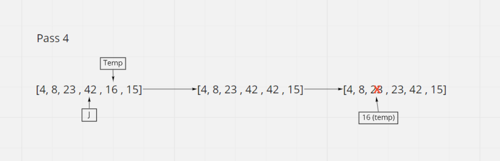

# Insertion Sort

Insertion Sort is an algorithm that takes in an array and sorts the array numerically. The function starts at the beginning of the array and works until it reaches the end. If current value is less than the previous value in the array, the current value is assigned to the previous value. 

## Psuedocode
  InsertionSort(int[] arr)

    FOR i = 1 to arr.length

      int j <-- i - 1
      int temp <-- arr[i]

      WHILE j >= 0 AND temp < arr[j]
        arr[j + 1] <-- arr[j]
        j <-- j - 1

      arr[j + 1] <-- temp

## Trace
Sample Array: [8,4,23,42,16,15]

Pass 1: 
On the first loop you start at index 1 which is also declared as the temp variable. J is set to 0. Since J is equal 0 and temp (4) is less than arr[j] (8) you enter the while loop. Inside the while loop index 1 of the array is set to arr[j] (8). Then j is decremented, and we break out of the while loop since -1 is not greater than or equal to 1. After we exit the while loop arr[j+1] (index 0) is set to the temp variable (4).

Pass 2: 
On the second loop you start at index 2 which is also declared as the temp variable (23) and j is set to 1. Since (23) is greater than arr[j] (8), you do not enter the while loop and the array does not change.

Pass 3: 
On the third loop you start at index 3 which is also declared as the temp variable (42) and j is set to 2. Since (42) is greater than arr[j] (23), you do not enter the while loop and the array does not change.

Pass 4: 
On the fourth loop you start at index 4 which is also declared as the temp variable (16) and j is set to 3. Since temp (16) is less than arr[j] (42) and j is greater than 0, you enter the while loop. Inside the while loop index 4 of the array is set to arr[j] (42). Then j is decremented. We then continue through the while loop, because j (2) is greater than 0 and temp (16) is less than arr[j] (23). Index 3 of the array is set to arr[j] (23). j is decremented again, and we break out of the while because even though j (1) is greater than 0, temp (16) is greater than arr[j] (15). After we exit the while loop arr[j+1] (index 2) is set to the temp variable (16).

Pass 5: 
On the fifth loop you start at index 5 which is also declared as the temp variable (15) and j is set to 4. Since temp (15) is less than arr[j] (42) and j is greater than 0, you enter the while loop. Inside the while loop index 5 of the array is set to arr[j] (42). Then j is decremented. We then continue through the while loop, because j (3) is greater than 0 and temp (15) is less than arr[j] (23). Index 4 of the array is set to arr[j] (23). j is decremented again. We then continue through the while loop, because j (2) is greater than 0 and temp (15) is less than arr[j] (16). Index 3 of the array is set to arr[j] (16). j is decremented again, and we break out of the while because even though j (1) is greater than 0, temp (15) is greater than arr[j] (8). After we exit the while loop arr[j+1] (index 2) is set to the temp variable (16).

Efficency
Time: O(n^2)
The basic operation of this algorithm is comparison. This will happen n * (n-1) number of times…concluding the algorithm to be n squared.
Space: O(1)
No additional space is being created. This array is being sorted in place…keeping the space at constant O(1).