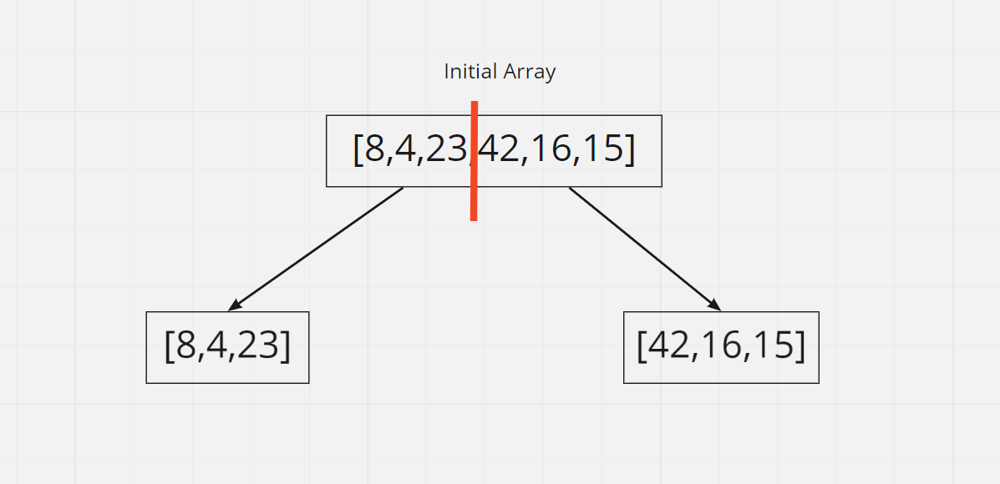

# Merge Sort

Merge Sort is an algorithm that takes in an array and sorts the array numerically. The function works by splitting the initial array in half. Recursion is used to split the left and right side of the arrays until there is only one number. Then the numbers from the left are sorted numerically and the same with the right. Finally the left and right are merged with each other and the sorted array is returned.

## Psuedocode
ALGORITHM Mergesort(arr)
    DECLARE n <-- arr.length

    if n > 1
      DECLARE mid <-- n/2
      DECLARE left <-- arr[0...mid]
      DECLARE right <-- arr[mid...n]
      // sort the left side
      Mergesort(left)
      // sort the right side
      Mergesort(right)
      // merge the sorted left and right sides together
      Merge(left, right, arr)

ALGORITHM Merge(left, right, arr)
    DECLARE i <-- 0
    DECLARE j <-- 0
    DECLARE k <-- 0

    while i < left.length && j < right.length
        if left[i] <= right[j]
            arr[k] <-- left[i]
            i <-- i + 1
        else
            arr[k] <-- right[j]
            j <-- j + 1

        k <-- k + 1

    if i = left.length
       set remaining entries in arr to remaining values in right
    else
       set remaining entries in arr to remaining values in left

## Trace
Sample Array: [8,4,23,42,16,15]

1st Split: 
We first declare a middle variable which is arr.length/2 (use Math.floor for rounding purposes on odd number arrays) The left variable will be equal to an array left 3 numbers (8,4,23) by using the slice function (arr.slice(0, mid)). The right variable will be equal to an array right 3 numbers (42,16,15) by using the splice function(arr.slice(mid)) We are left with 2 arrays and then we call the mergeSort funciton on both arrays.

2nd Split: 
Next, the left array is split between the 0 index and 1 index (due to Math.floor rounding down) and we are left with 2 arrays with the left being [8], and right being [4,23]. Since the left array only contains one number it will no longer be split. The right array will be split once again and the left array will be [4] and the right array will be [23].

3rd Split:
Similiar to the left array, the right array is split between the 0 index and 1 index (due to Math.floor rounding down) and we are left with 2 arrays with the left being [42], and right being [16,15]. Since the left array only contains one number it will no longer be split. The right array will be split once again and the left array will be [16] and the right array will be [15].

First Merge:
After all arrays have been split to contain only one element for the left and right variable, the arrays are then merged. We merge the numbers on the left (8,4,23), by comparing them to each other and sorting them in an array. We are given a sorted array ([4,8,23]). A merge is also performed on the numbers on the right (42,16,15) and we are given a sorted array of [15,16,42]

Final Merge:
Finally, the left array and the right array are merged with each other. We are given the final assorted array of [4,8,15,16,23,42].

Efficency
Time: O(nlogn)  
Space: O(n).