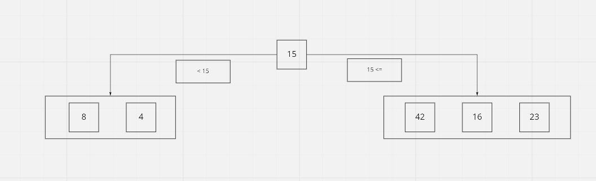

# Merge Sort

## Psuedocode

ALGORITHM QuickSort(arr, left, right)  
if left < right  
    // Partition the array by setting the position of the pivot value  
    DEFINE position <-- Partition(arr, left, right)  
    // Sort the left  
    QuickSort(arr, left, position - 1)  
    // Sort the right  
    QuickSort(arr, position + 1, right)  
  
  

ALGORITHM Partition(arr, left, right)  
    // set a pivot value as a point of reference  
    DEFINE pivot <-- arr[right]  
    // create a variable to track the largest index of numbers lower than the defined pivot  
    DEFINE low <-- left - 1  
    for i <- left to right do  
        if arr[i] <= pivot  
            low++  
            Swap(arr, i, low)  
    // place the value of the pivot location in the middle.  
    // all numbers smaller than the pivot are on the left, larger on the right.  
        Swap(arr, right, low + 1)  
    // return the pivot index point  
        return low + 1  

ALGORITHM Swap(arr, i, low)  
    DEFINE temp;  
    temp <-- arr[i]  
    arr[i] <-- arr[low]  
    arr[low] <-- temp  

## Trace
Sample Array: [8,4,23,42,16,15]

Step 1: 
We start out with an array and within our function we declare the left and right, where the left is the beginning (1st index) of the array and the right is the end of the array (last index). The pivot is declared and is initially set to the right (15). 

Step 2:
we then set our pivot on the left side of the initial pivot (15) and the new pivot is now (4). We then compare this number with the other number left of the pivot which is 8. Since 8 is greater than 4, these values are swapped. Next we look at the right side and our pivot which is 42. We compare 42 to the other numbers on the right. Since 42 is greater than 16 and 23, it is moved to the end of the array (right). 16 is now on the left and since it is less than 23, no other sorting is required.

Return:
Finally after the array has been sorted it is returned.

Efficency
Time: O(nlogn)
Space: O(n)