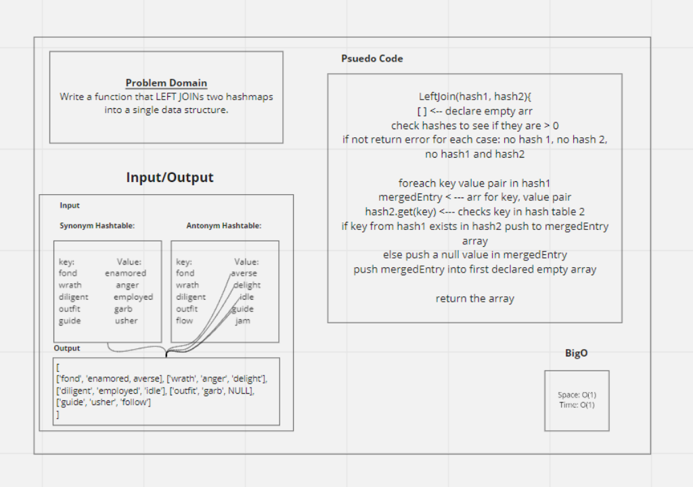

# Left Join
<!-- Short summary or background information -->
Write a function that LEFT JOINs two hashmaps into a single data structure.

## Challenge
<!-- Description of the challenge -->
Write a function that LEFT JOINs two hashmaps into a single data structure.

- Write a function called left join
- Arguments: two hash maps
  - The first parameter is a hashmap that has word strings as keys, and a synonym of the key as values.
  - The second parameter is a hashmap that has word strings as keys, and antonyms of the key as values.
 - Return: The returned data structure that holds the results is up to you. It doesn’t need to exactly match the output below, so long as it achieves the LEFT JOIN logic

## Approach & Efficiency
<!-- What approach did you take? Why? What is the Big O space/time for this approach? -->
- repeat:
  - time: O(1)
  - space: O(1)

## Solution
<!-- Embedded whiteboard image -->

