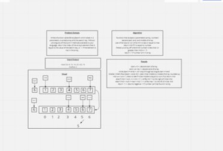

# Insert to Middle of an Array
<!-- Description of the challenge -->
Write a function called BinarySearch which takes in 2 parameters: a sorted array and the search key. Without utilizing any of the built-in methods available to your language, return the index of the array’s element that is equal to the value of the search key, or -1 if the element is not in the array.

## Whiteboard Process
<!-- Embedded whiteboard image -->

## Approach & Efficiency
Decided to use a while loop to keep using else/ifs until mid was found. Shifted the min or max depending on whether the number for greater than or less than mid number. -1 has to be outside the while loop and that took a minute to figure out.