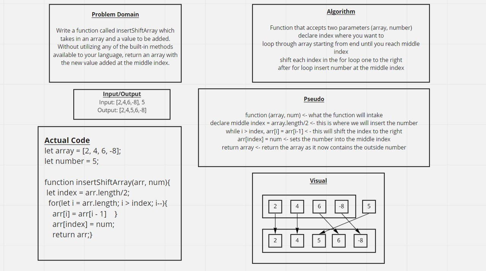

# Insert to Middle of an Array
<!-- Description of the challenge -->
Write a function called insertShiftArray which takes in an array and a value to be added. Without utilizing any of the built-in methods available to your language, return an array with the new value added at the middle index.

## Whiteboard Process
<!-- Embedded whiteboard image -->

## Approach & Efficiency
I first attempted to just add the number in the array at the middle index. A problem was immediately apparent as in my test replit it just added it to an index that already had a value. I then firgured out that I would have to shift the index points so that I could insert a value. I declared the middle index as a variable, because I was getting strange behavior when I tried to just use arr.length/2 in the for loop and where I wanted to add the number within the array.