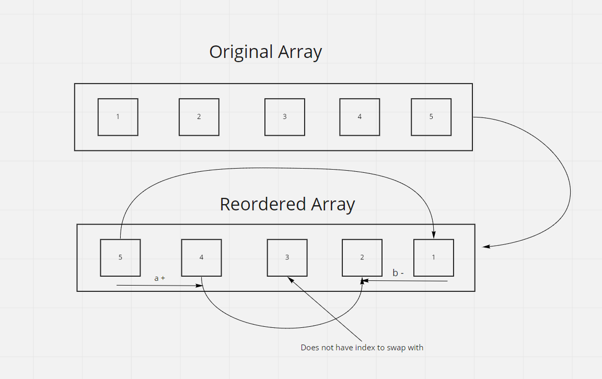

# Reverse Array

Write a function called reverseArray which takes an array as an argument. Without utilizing any of the built-in methods available to your language, return an array with elements in reversed order.

## Inputs/Outputs
Input: `[1,2,3,4,5,6]`  
Output: `[6,5,4,3,2,1]`  

## Algorithm
For loop to iterate through array to look at all the elements in an array
Swap each item with its inverse index within an array
Will only iterate half way through the array as going further will reswap indices

## pseudocode
for loop
declare variable a for start of array = 0
declare variable b for end of array = length-1
while a <= b
declare temp for arr[0]
arr[end] swaps with arr[begin]
temp gets pushed into arr[end]
a+
b+

## Whiteboard

